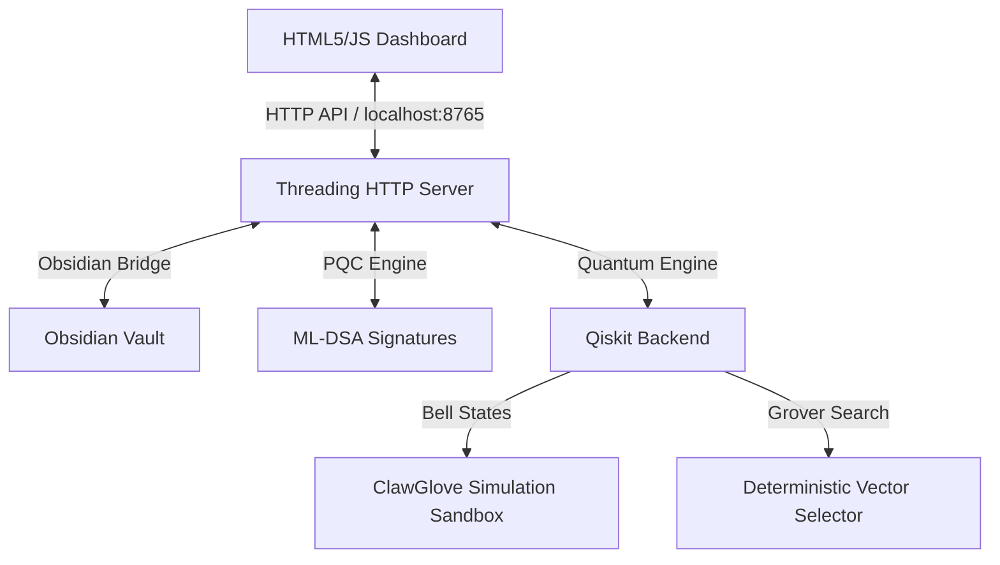

# Agent OS Quantum & Dashboard Integration

## Key Idea
Deterministic context verification and search logic integrated into Agent OS and ClawGlove using Qiskit simulated quantum circuits (Grover's Search and 2-qubit Bell State correlation checks), verified alongside post-quantum cryptography (PQC) signing.

## Details

### 1. Architecture Map

### 2. Quantum Engine Implementations
* **Grover's Search Selector (`propose_quantum`):** Rather than choosing random search states or heuristic walks in high-entropy terrains, the agent builds a quantum oracle matching the desired high-value state's binary address and runs $k = \lfloor \frac{\pi}{4}\sqrt{2^n} \rfloor$ Grover iterations to amplify its amplitude.
* **Bell State TOCTOU Defense (`quantum_context_check`):** Verifies the context signature using a 2-qubit Bell State $| \Phi^+ \rangle = \frac{1}{\sqrt{2}}(|00\rangle + |11\rangle)$. If a threat actor attempts to tamper with the context memory before execution (TOCTOU attack), the entanglement is broken (represented by an injected bit-flip gate). The validation check reads 100 statistical shots; if the correlation ratio drops below 90%, it blocks the execution deterministically.

### 3. Applied Bug Fixes & Improvements
* **Grover Iterations Fix:** Fixed an iteration deficit where Grover's circuit was built with a single hardcoded iteration, which reduced success rate to 13.5% on 6-qubit terrains. Optimal iterations are now calculated dynamically.
* **Noise Fragility Fix:** Changed single-shot Bell verification to a 100-shot statistical evaluation (requiring $>90\%$ correlation) to prevent false-positives under transient real-world quantum hardware noise.
* **Threading HTTPServer Upgrade:** Resolved dashboard connection hangs during long-running agent tasks by migrating the API backend from `HTTPServer` to `ThreadingHTTPServer`.
* **API Security & Key Injection:** Avoided client-side API key exposure by dynamically injecting API keys from the `.env` file when serving `/dashboard`.

## Action / Next Steps
- [ ] Deploy the dashboard server to launch on startup.
- [ ] Connect the simulation logs to the main Obsidian Dashboard view.
- [ ] Test the Qiskit engine on an active IBM Quantum API backend.
